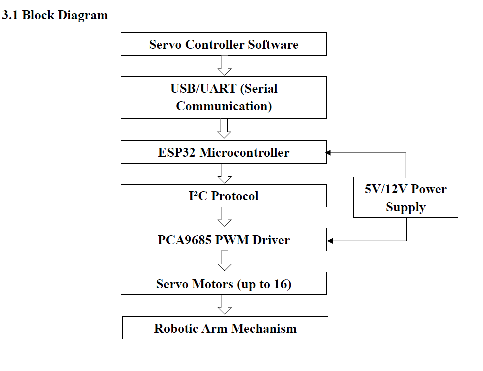
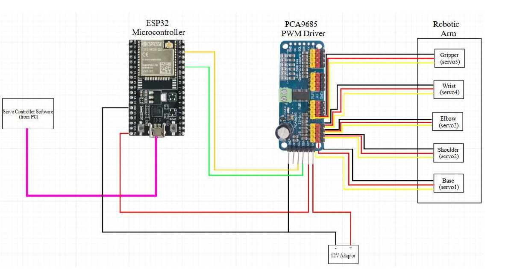
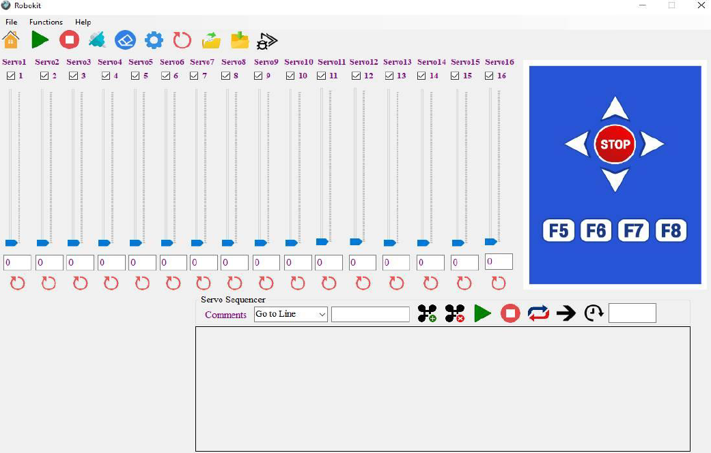

# 🤖 Robotic Arm Controller

A 5-DOF (Degrees of Freedom) robotic arm control system designed for industrial pick-and-place operations. The system combines an ESP32 microcontroller, PCA9685 PWM driver, and a custom VB.NET desktop GUI to enable precise, programmable control of up to 16 servo motors via UART and I2C protocols.

**Author:** Venu S  
**Project Type:** Personal / Academic Project  
**Duration:** Apr 2025 – Aug 2025

---

## 🎯 Project Highlights

- **5-DOF robotic arm** using ESP32 + PCA9685 + VTS-08A/SG90 servos
- **Custom VB.NET GUI** for manual control, motion sequencing, and Arduino code export
- **Layered communication protocols**: UART (PC ↔ ESP32) + I2C (ESP32 ↔ PCA9685)
- **16-channel PWM control** with 12-bit resolution via PCA9685
- **Offline sequence execution** — arm runs autonomously without PC after flashing

---

## 🏗 System Architecture

### Block Diagram



**Data flow:**

### Circuit Diagram



---

## 🛠 Hardware Components

| Component | Specification | Purpose |
|-----------|--------------|---------|
| **ESP32** | Dual-core Xtensa LX6 @ 240 MHz, Wi-Fi + BT, 520 KB SRAM | Main controller |
| **PCA9685** | 16-channel, 12-bit PWM driver, I2C interface | Servo control |
| **VTS-08A Servo** | 5–6.6V, 0–180°, high torque | Base, shoulder, elbow, wrist |
| **SG90 Servo** | 5V, 0–180°, micro servo | Gripper (lightweight joints) |
| **Power Supply** | 5V/6V @ ≥5A (external) | Servo power (isolated from logic) |

### Pin Connections

| ESP32 Pin | Connects To | Protocol |
|-----------|-------------|----------|
| GPIO21 | PCA9685 SDA | I2C |
| GPIO22 | PCA9685 SCL | I2C |
| 3.3V | PCA9685 VCC | Logic power |
| GND | PCA9685 GND + Servo GND | Common ground |
| USB | PC (VB.NET GUI) | UART @ 115200 bps |

**PCA9685:**
- Channels 0–15 → Servo PWM inputs
- V+ terminal → External 5V/6V @ ≥5A supply
- Logic VCC → 3.3V from ESP32

---

## 💻 Software Architecture

### 1. VB.NET GUI (PC Side)

Features:
- Manual servo control (sliders + numeric input, 0–180°)
- Motion sequencer (record + replay positions)
- **Arduino-compatible code export** for offline execution
- Real-time position feedback
- Servo grouping and custom naming
- Min/Max position limits for safety



### 2. ESP32 Firmware

**Responsibilities:**
- Receive 34-byte UART packets from PC
- Parse packet header (0xAA = start, 0x0A = command ID)
- Convert 2-byte values → PWM pulse widths (500–2400 μs)
- Send 12-bit PWM values to PCA9685 via I2C

**Firmware:**

```cpp
#include <Wire.h>
#include <Adafruit_PWMServoDriver.h>

Adafruit_PWMServoDriver pwm = Adafruit_PWMServoDriver(0x40);

void setup() {
  Serial.begin(115200);
  Wire.begin(21, 22);           // SDA=21, SCL=22
  pwm.begin();
  pwm.setPWMFreq(50);            // 50 Hz for servos
}

void loop() {
  if (Serial.available() >= 34) {
    uint8_t buffer[34];
    Serial.readBytes(buffer, 34);

    if (buffer[0] == 0xAA && buffer[1] == 0x0A) {
      for (int i = 0; i < 16; i++) {
        int lsb = buffer[2 + (i * 2)];
        int msb = buffer[3 + (i * 2)];
        int pulse = (msb << 8) | lsb;

        if (pulse > 0) {
          int pwm_val = map(pulse, 500, 2400, 102, 491);
          pwm.setPWM(i, 0, pwm_val);
        }
      }
    }
  }
}
